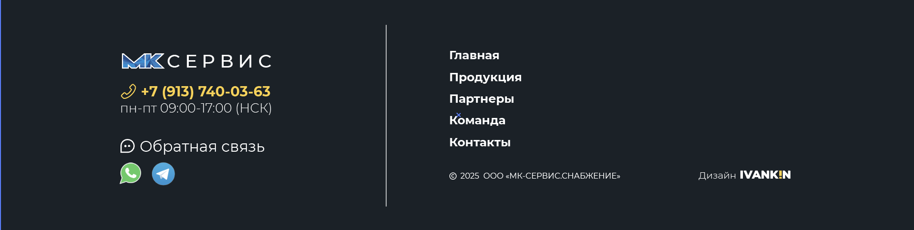

### Описание компонента: Футер (Подвал сайта)

1.  **Название Секции и Контекст:**

    - **Как называется эта секция?** Футер (Подвал сайта) или Контакты и навигация в подвале.
    - **Какова основная цель секции?** Предоставить ключевую контактную информацию, быстрые ссылки на основные разделы сайта (навигация), ссылки на мессенджеры для обратной связи, а также информацию об авторских правах и разработчике.
    - **Где она должна располагаться относительно других секций?** Это самая нижняя секция на всех страницах сайта, расположенная непосредственно после всех основных секций контента (например, после секции с картой и контактами).

2.  **Имя Компонента:**

    - **Предложите многословное имя для Vue компонента.** `MksFooter`.

3.  **Описание Структуры и Расположения Элементов:**

    - **Опишите основные блоки и элементы секции.**
      Секция футера представляет собой горизонтально расположенный блок с темно-серым фоном. Его содержимое разделено на две основные вертикальные колонки тонкой белой разделительной линией. Все элементы выровнены по левому краю внутри своих блоков, за исключением логотипа дизайнера, который может быть выровнен по правому краю в своей части.

      Основные блоки:

      - **Левая колонка:**
        - **Логотип компании:** "МК СЕРВИС" (сине-белый).
        - **Контактный телефон:** Иконка телефона, номер телефона и режим работы.
        - **Блок обратной связи:** Текст "Обратная связь" с иконкой чата, а также иконки мессенджеров (WhatsApp, Telegram).
      - **Правая колонка:**
        - **Навигационное меню:** Список ссылок на основные разделы сайта ("Главная", "Продукция", "Партнеры", "Команда", "Контакты").
        - **Копирайт и информация о дизайнере:** Текст с годом и названием компании, а также текст "Дизайн" с логотипом "IVANKIN".

    - **Как элементы расположены друг относительно друга?**

      - Содержимое футера центрировано горизонтально в пределах фиксированной ширины контейнера.
      - Две колонки равномерно распределяют доступное пространство, с вертикальной линией по центру, которая разделяет их.
      - **В левой колонке:** Элементы расположены вертикально: логотип, затем телефон с режимом работы (телефон крупнее), затем блок обратной связи (текст и иконки мессенджеров, расположенные горизонтально под текстом). Между блоками есть вертикальные отступы.
      - **В правой колонке:** Навигационные ссылки расположены вертикально, каждая на новой строке, с вертикальными отступами между ними. Блок копирайта находится внизу колонки, горизонтально выровнен с блоком "Дизайн IVANKIN".

    - **Есть ли особенности адаптивной верстки?**
      - На больших экранах (десктоп): Футер отображается в две колонки с вертикальной разделительной линией.
      - На средних/малых экранах (планшеты/мобильные): Две колонки должны трансформироваться в одну вертикальную стопку. Вероятно, левая колонка будет сверху, правая снизу.
      - Внутренние отступы (`padding`) и межэлементные отступы должны быть адаптивными, чтобы обеспечить читаемость на всех размерах экрана.
      - Размеры шрифтов могут уменьшаться для мобильных устройств.
      - Иконки мессенджеров должны оставаться видимыми и кликабельными.

4.  **Содержание Текста и Данных:**

    - **Предоставьте точный текст для всех текстовых элементов.**

      - **Логотип:** "МК СЕРВИС" (предполагается как изображение или SVG).
      - **Телефон:** "+7 (913) 740-03-63"
      - **Режим работы:** "пн-пт 09:00-17:00 (НСК)"
      - **Заголовок обратной связи:** "Обратная связь"
      - **Навигационные ссылки:** "Главная", "Продукция", "Партнеры", "Команда", "Контакты"
      - **Копирайт:** "© 2025 ООО «МК-СЕРВИС.СНАБЖЕНИЕ»"
      - **Текст дизайна:** "Дизайн"
      - **Логотип дизайнера:** "IVANKIN" (предполагается как изображение или часть текста со стилем).

    - **Если есть повторяющиеся элементы (карточки, списки), опишите структуру данных для одного элемента и их количество.**

      ```javascript
      const footerData = {
        logo: { src: '/path/to/mks-logo.svg', alt: 'МК СЕРВИС' },
        contacts: {
          phone: '+7 (913) 740-03-63',
          schedule: 'пн-пт 09:00-17:00 (НСК)',
          feedbackTitle: 'Обратная связь',
          messengers: [
            {
              name: 'WhatsApp',
              icon: 'IconWhatsApp.vue',
              url: 'https://wa.me/79137400363',
            },
            {
              name: 'Telegram',
              icon: 'IconTelegram.vue',
              url: 'https://t.me/your_telegram_channel',
            },
          ],
        },
        navigation: [
          { label: 'Главная', id: 'main' },
          { label: 'Продукция', id: 'продукция' },
          { label: 'Партнеры', id: 'партнеры' },
          { label: 'Команда', id: 'команда' },
          { label: 'Контакты', id: 'контакты' },
        ],
        copyright: '© 2025 ООО «МК-СЕРВИС.СНАБЖЕНИЕ»',
        designer: {
          text: 'Дизайн',
          logo: { src: '/path/to/ivankin-logo.svg', alt: 'IVANKIN' }, // Или просто текст, если это не изображение
          url: 'https://ivankin.com', // Пример ссылки на дизайнера
        },
      };
      ```

5.  **Визуальное Оформление и Стили:**

    - **Укажите основные цвета.**

      - **Фон футера:** `#282C34` (темно-синий/почти черный).
      - **Основной текст (навигация, копирайт, режим работы):** `#FFFFFF` (белый) или `#C9C9C9` (светло-серый) для менее акцентного текста.
      - **Телефонный номер:** `#FFD13D` (желто-оранжевый).
      - **Разделительная линия:** `rgba(255, 255, 255, 0.3)` или светлый серый.
      - **Цвет иконок мессенджеров:** WhatsApp - зеленый, Telegram - синий (цвета иконок должны соответствовать брендам).

    - **Обратите внимание на шрифты, размеры текста, отступы.**

      - **Шрифт:** Предположительно системный без засечек (например, Arial, Helvetica, sans-serif).
      - **Логотип:** Уникальный шрифт/стиль, если не изображение.
      - **Телефон:**
        - Размер: около `22px` - `24px`.
        - Начертание: жирное (`font-weight: 700`).
        - Цвет: `#FFD13D`.
      - **Режим работы:**
        - Размер: около `16px`.
        - Начертание: обычное (`font-weight: 400`).
        - Цвет: `#C9C9C9`.
      - **"Обратная связь"**:
        - Размер: около `18px`.
        - Начертание: обычное (`font-weight: 400`).
        - Цвет: `#FFFFFF`.
      - **Навигационные ссылки:**
        - Размер: около `20px` - `22px`.
        - Начертание: жирное (`font-weight: 700`).
        - Цвет: `#FFFFFF`.
        - При наведении: возможно подчеркивание или легкое изменение цвета.
      - **Копирайт и "Дизайн"**:
        - Размер: около `14px` - `16px`.
        - Начертание: обычное (`font-weight: 400`).
        - Цвет: `#C9C9C9`.
      - **"IVANKIN"**:
        - Размер: как у копирайта, но жирное (`font-weight: 700`) или уникальный шрифт/стиль.
        - Цвет: `#FFFFFF`.
      - **Отступы:**
        - Общий `padding` для футера (сверху/снизу): около `60px` - `80px`.
        - Горизонтальный `padding` внутри контейнера: стандартный для сайта.
        - Вертикальные отступы между блоками в колонках: около `20px` - `40px`.
        - Отступы между иконками мессенджеров: около `12px` - `16px`.

    - **Есть ли фоновые изображения, градиенты, тени, границы, скругления углов?**

      - **Фон футера:** Сплошной цвет `#282C34`.
      - **Вертикальная разделительная линия:** `border-right: 1px solid rgba(255, 255, 255, 0.3);` на правой колонке, или же отдельный `div` с такой линией, расположенный по центру.
      - **Иконки мессенджеров:** Круглые формы, возможно, с легкими тенями или эффектами при наведении. Будут добавлены позже.

    - **Укажите, использовать ли Tailwind CSS классы.** Да, использовать Tailwind CSS классы для стилизации.

6.  **Интерактивные Элементы:**

    - **Опишите назначение и базовое поведение интерактивных элементов (кнопки, ссылки, формы).**
      - **Телефон:** Кликабельная ссылка (`tel:`), при клике предлагает позвонить.
      - **Иконки мессенджеров (WhatsApp, Telegram):** Кликабельные ссылки, перенаправляющие на соответствующую платформу. При наведении могут менять прозрачность или давать легкий эффект масштабирования/тени.
      - **Навигационные ссылки:** Кликабельные ссылки, при клике должны осуществлять плавную прокрутку к соответствующим секциям на странице (используя `id` секций, как в `MksHeader`).
      - **Логотип "IVANKIN"**: Если это ссылка, то кликабельная, ведущая на сайт дизайнера.

7.  **Используемые Ресурсы (Изображения, Иконки):**

    - **Укажите, где находятся изображения или иконки.**
      - Логотип "МК СЕРВИС": PNG файл (`/src/assets/images/logo-mks-service.png`).
      - Иконки: Телефон, Чат (для "Обратная связь"), WhatsApp, Telegram. Это PNG и SVG файлы (`/src/assets/icons/phone.svg`, `/src/assets/icons/icon-chat.png`, `/src/assets/icons/icon-whatsapp.svg`, `/src/assets/icons/icon-telegram.svg`).
      - Логотип "IVANKIN": PNG файл (`/src/assets/images/logo-ivankin.png`).

8.  **Скриншот:**

    
